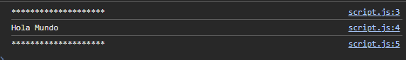
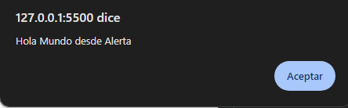

# Hola Mundo

Programa que muestra un mensaje en consola y con una alerta de Hola Mundo.

## Lenguaje.

| HTML || JavaScript |

## Uso de:

> console.log

> alert

## Resultados:

> Consola:

> Alerta:

