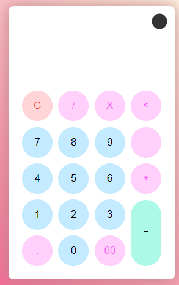
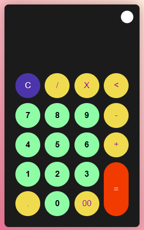

# Calculadora.

Ejercicio de YouTube.

Codigo 369

## Lenguaje.

| HTML || JavaScript || CSS |

## Uso de:

> Funciones

> Condicionales

> Relacionales

## Resultados:

> Tema Claro

> Tema Dark

