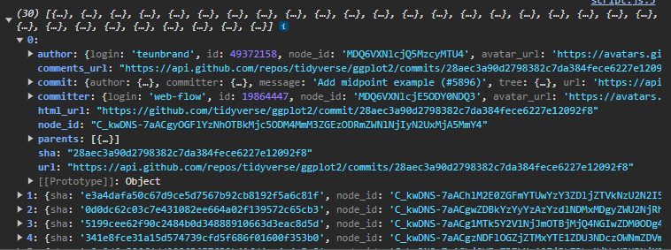

# Datos Json

Ejercicio de YouTube

Codigo 369

## Lenguaje.

| HTML || JavaScript |

## Uso de:

> Funcion asincrona

> Consumo de API

> Fetch

> Catch

## Resultados:

Muestra en HTML.

Muestra en consola y en formato json los datos de API

