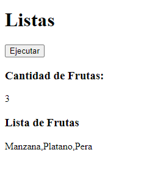

# Arrays

Ejercicio de YouTube

Codigo 369

## Lenguaje.

| HTML || JavaScript |

## Uso de:

> Funciones

> Operaciones

> DOM

> Eventos

## Resultados:

Muestra en HTML.

1. Muestra la cantidad de elementos que se encuentra en una lista.

2. Muestra la lista en la pantalla del Index.html

