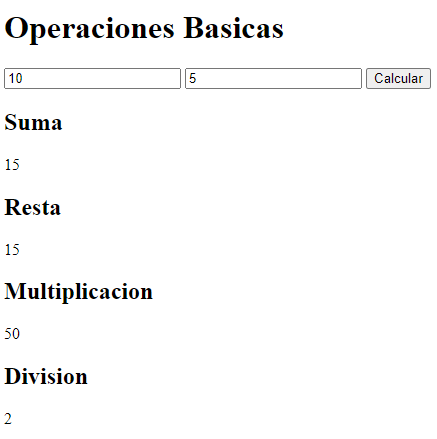

# Operaciones

Ejercicio de YouTube

Codigo 369

## Lenguaje.

| HTML || JavaScript |

## Uso de:

> Funciones

> Operaciones

> DOM

> Eventos

## Resultados:

Muestra en HTML los resultados de las operaciones.

