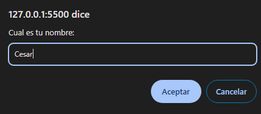
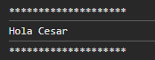
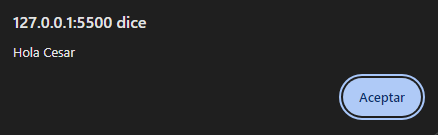

# Saludo Personalizado.

Programa que muestra en consola y con una alerta un saludo al usuario.

## Lenguaje.

| HTML || JavaScript |

## Uso de:

> console.log

> alert

> prompt

## Resultados:

> Entrada datos.

> Consola

> Alerta

